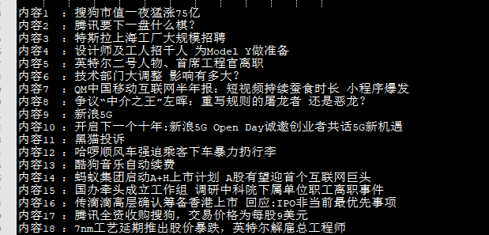

# 基于BeautifulSoup的简单的新闻爬虫


使用BeautifulSoup定位网页元素，获取新闻标题和网址到txt文件中。可以自己添加其他的网页和爬虫属性。

对于163网站直接获取新闻标题不全的问题，使用`detail_into_page`函数单独进入网页获取到。

## requirements:
```
requests
BeautifulSoup
```

## 使用:
```
cd ...
python get_news.py
```

## demo

